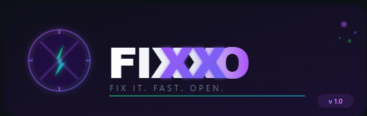
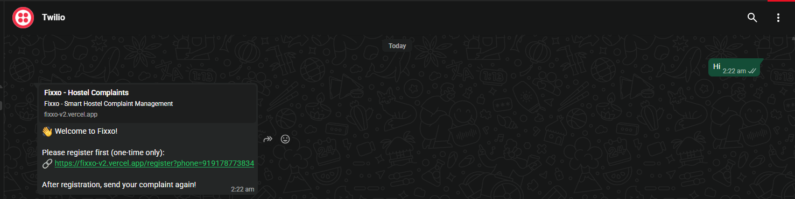
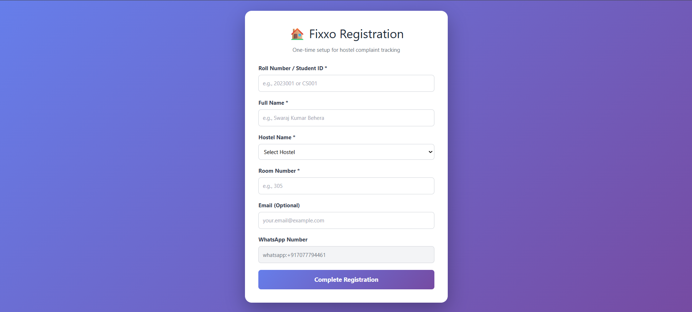
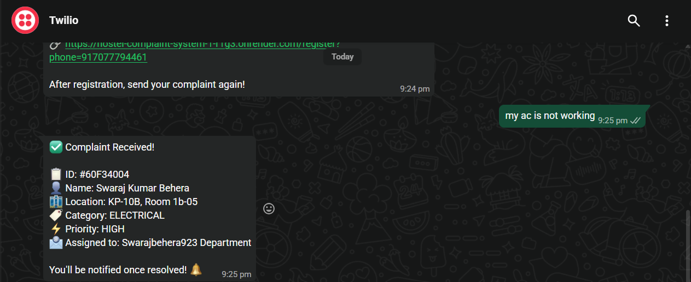
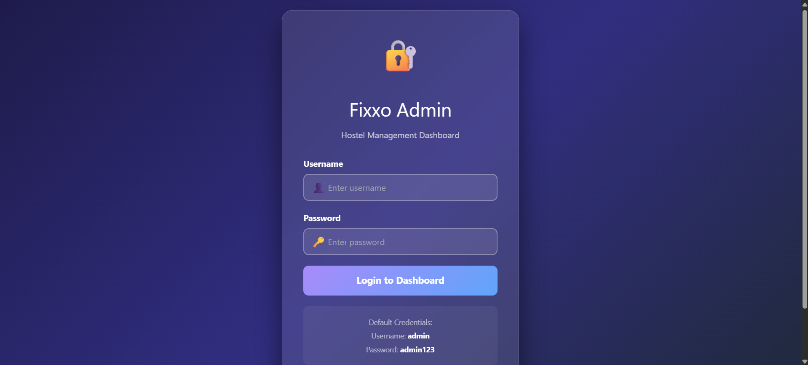
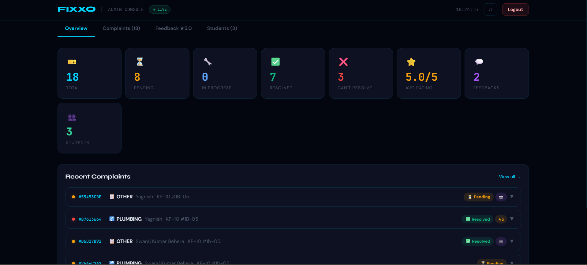
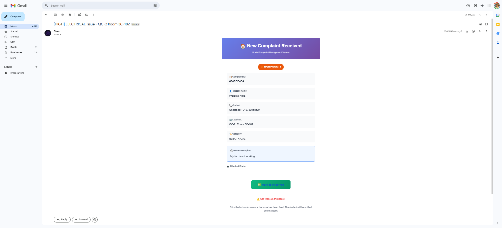
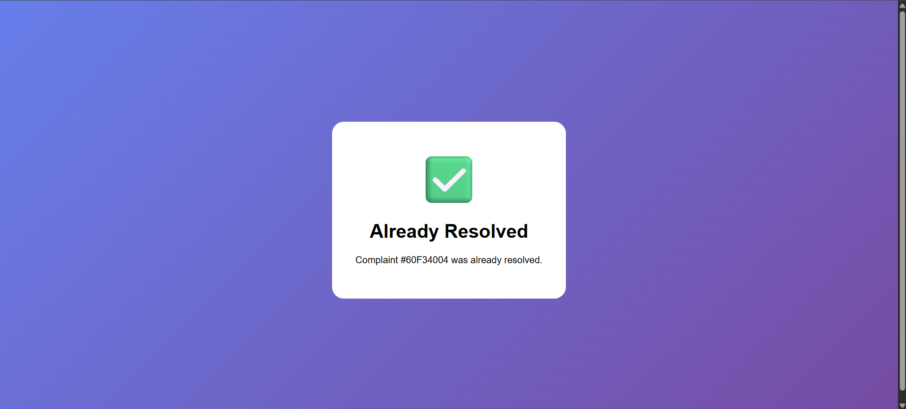
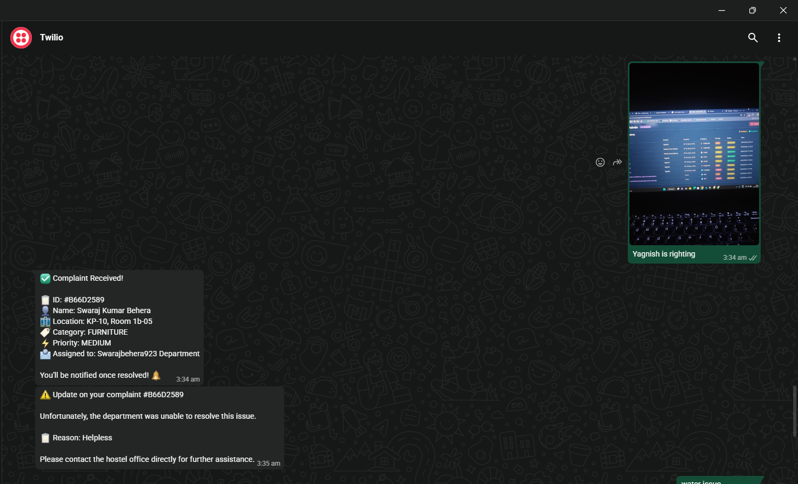

<div align="center">



# ⚡ Fixxo

[](/LICENSE)
[](https://python.org)
[](https://flask.palletsprojects.com)
[](/actions)
[](/CONTRIBUTING.md)
[]()

> AI-powered WhatsApp complaint management for university hostels.  
> Student texts a problem → AI classifies it → Department gets an email → One click resolves it → Student is notified.  
> **No app. No forms. Just WhatsApp.**

</div>

---

## 📖 Contents

- [Problem](#-problem)
- [Demo](#-demo)
- [Screenshots](#-screenshots)
- [Features](#-features)
- [Tech Stack](#-tech-stack)
- [Architecture](#-architecture)
- [Quick Start](#-quick-start)
- [Project Structure](#-project-structure)
- [Roadmap](#-roadmap)
- [Contributing](#-contributing)
- [Team](#-team)
- [License](#-license)

---

## 🎯 Problem

Every university hostel has a paper complaint register. Students walk to the warden's office, write their issue, and then hear nothing for days. There's no tracking, no acknowledgement, no accountability. Complaints get lost, repeated, or simply ignored.

**Average resolution time: 5–7 days. Our target: under 24 hours.**

---

## 🎬 Demo

**Student sends:**

```
my ac is not working
```

**System replies instantly:**

```
✅ Complaint Received!

📋 ID: #60F34004
🏢 Name: Swaraj Kumar Behera
🏗️ Location: KP-10B, Room 1b-05
🏷️ Category: ELECTRICAL
⚡ Priority: HIGH
📬 Assigned to: Department

You'll be notified once resolved! 🔔
```

**Live deployment:** https://fixxo-v2.vercel.app

**▶️ Watch the full demo video:**

[](https://youtu.be/J7bmTQkHBHU?si=7DTiLBVF8WX7by7k)

---

## 📸 Screenshots

### 🔐 Student Registration (One-Time Setup)

When a new student messages Fixxo for the first time, they receive a registration link on WhatsApp.

| First-Time WhatsApp Prompt | Registration Form |
|:-:|:-:|
|  |  |

---

### 💬 Student Submits Complaint via WhatsApp

After registration, the student types their issue in plain text — Fixxo handles the rest.

| WhatsApp Complaint Received |
|:-:|
|  |

Groq AI auto-classifies into a category (ELECTRICAL, PLUMBING, FURNITURE, etc.), assigns priority, and generates a unique complaint ID.

---

### 🛠️ Admin Dashboard

Admins get a live mission-control view of all complaints across the hostel.

| Admin Login | Admin Overview |
|:-:|:-:|
|  |  |

---

### 📧 Department Email Notification

The relevant department receives a rich HTML email with a one-click **Mark as Resolved** button.

| Department Email |
|:-:|
|  |

---

### ✅ Resolution Flow

When the department resolves the complaint, a confirmation page is shown and the student is **automatically notified on WhatsApp**.

| Resolved Confirmation Page | Student Notified on WhatsApp |
|:-:|:-:|
|  |  |

---

## ✨ Features

- **📱 WhatsApp-native** — No app download. No training needed for students.
- **🤖 AI Classification** — 8 complaint categories, detected automatically via Groq AI.
- **⚡ Priority Detection** — URGENT / HIGH / MEDIUM detected from natural language.
- **📍 Smart Extraction** — Detects hostel block and room from unstructured text.
- **🏢 Auto-routing** — Correct department emailed instantly.
- **📧 Rich HTML Emails** — Colour-coded priority, full details, one-click resolve.
- **✅ One-Click Resolution** — Department resolves directly from email, no login needed.
- **📲 Auto-Reply on Resolve** — Student notified on WhatsApp when fixed.
- **💾 Full Audit Trail** — Every complaint tracked in Supabase PostgreSQL with timestamps.
- **🔒 Secure Tokens** — Cryptographic one-time tokens prevent fake resolutions.
- **🖥️ Admin Dashboard** — React-based mission control with live stats and complaint feed.
- **🔐 OTP Registration** — Restricted to `@kiit.ac.in` email addresses.

---

## 🛠️ Tech Stack

| Layer | Technology |
|---|---|
| Backend | Flask (Python 3.8+) |
| Frontend | React.js + Tailwind CSS |
| Messaging | Twilio WhatsApp Business API |
| AI/NLP | Groq API (LLaMA 3) |
| Database | PostgreSQL via Supabase |
| Email | Resend API / Gmail SMTP |
| Deployment | Vercel (frontend) + Render (backend) |
| CI/CD | GitHub Actions |

---

## 🏗️ Architecture

```
Student (WhatsApp)
      │
      ▼
Twilio API ──POST /webhook──▶ Flask (app.py)
                                    │
                          ┌─────────┴──────────┐
                          ▼                    ▼
               Groq AI Classifier         database.py
               (classify complaint)       (save to Supabase)
                          │
                          ▼
                     email_sender.py
                   (Resend API → dept)
                          │
                 Department clicks resolve
                          │
                   GET /resolve ──▶ Flask
                                      │
                               ┌──────┴──────┐
                               ▼             ▼
                          database.py    Twilio API
                          RESOLVED     (notify student)
```

Full diagram → [docs/ARCHITECTURE.md](docs/ARCHITECTURE.md)

---

## 🚀 Quick Start

```bash
git clone https://github.com/swaraj3092/fixxo.git
cd fixxo

python -m venv venv
venv\Scripts\activate        # Windows
# source venv/bin/activate   # Mac/Linux

pip install -r requirements.txt
cp .env.example .env
# Edit .env with your credentials

python src/app.py
```

Full guide → [docs/INSTALLATION.md](docs/INSTALLATION.md)

---

## 📂 Project Structure

```
fixxo/
│
├── src/
│   ├── app.py                   # Flask server — all HTTP routes
│   ├── ai_classifier_simple.py  # Groq AI classifier
│   ├── database.py              # Supabase database operations
│   └── email_sender.py          # Resend HTML email notifications
│
├── tests/
│   ├── test_classifier.py
│   ├── test_database.py
│   └── test_email.py
│
├── docs/
│   ├── logo.png                 # Fixxo logo
│   ├── ARCHITECTURE.md
│   ├── INSTALLATION.md
│   ├── PITCH.md
│   └── screenshots/             # All UI screenshots
│
├── examples/
│   ├── test_messages.txt
│   └── sample_complaints.json
│
├── .github/
│   ├── workflows/ci.yml
│   ├── ISSUE_TEMPLATE/
│   └── PULL_REQUEST_TEMPLATE.md
│
├── render.yaml
├── requirements.txt
├── .env.example
├── .gitignore
├── README.md
├── CONTRIBUTING.md
├── CODE_OF_CONDUCT.md
└── ROADMAP.md
```

---

## 🗺️ Roadmap

See [ROADMAP.md](ROADMAP.md) for full details.

**v1.0 — Current**

- ✅ WhatsApp via Twilio
- ✅ Groq AI classification — 8 categories
- ✅ Auto-routing via Resend email
- ✅ One-click resolution from email
- ✅ Student WhatsApp notification on resolve
- ✅ Supabase audit trail + secure tokens
- ✅ React admin dashboard with live stats
- ✅ OTP-verified registration (@kiit.ac.in)
- ✅ Deployed on Vercel + Render

**v1.1 — Planned**

- 🔄 Hindi language support
- 🔄 Image/photo complaint analysis
- 🔄 Auto-escalation after 24 hours

**v2.0 — Future**

- 📋 Multi-campus support
- 📱 Department mobile app
- 📊 Advanced analytics & reporting

---

## 🤝 Contributing

See [CONTRIBUTING.md](CONTRIBUTING.md) for guidelines.

**Good first issues:**

- Add Hindi keywords (`पानी` → PLUMBING, `बिजली` → ELECTRICAL)
- Write tests for FOOD and CLEANLINESS categories
- Improve Groq prompt for edge cases

---

## 👥 Team

**CodeSync** — Built for Open Source Forge @ KIIT Fest 2026

| Member | Role | Contributions |
|--------|------|---------------|
| [Swaraj Kumar Behera](https://github.com/swaraj3092) | Team Lead & Backend Engineer | Flask API architecture, Twilio WhatsApp webhook integration, Groq/LLaMA AI classifier, Supabase schema design, Render deployment, CI/CD pipeline |
| [Prajakta Kuila](https://github.com/) | Frontend & Integration | React admin dashboard UI, complaint card components, OTP-based auth flow, Resend email integration, KP/QC hostel toggle |
| [Yagnish Anupam](https://github.com/) | Testing & Documentation | Unit test suite (25+ classifier tests, DB & email tests), `examples/sample_complaints.json` corpus, `docs/ARCHITECTURE.md` write-up, `CONTRIBUTING.md` and issue templates, bug reporting and QA across WhatsApp → email → resolve flow |

---

> *Made with ❤️ for every hostel student who deserved faster maintenance.*

## 🏆 Achievements

- 🚀 **HackRent 2026** — Systems Track submission
- ⭐ 5.0/5 average feedback rating from test users

---

## 📜 License

[Apache License 2.0](LICENSE) — free for any university to deploy, fork, or build upon.

---

<div align="center">
  Made for university students who deserve faster maintenance. 🏠
  <br/><br/>
  <a href="https://fixxo-v2.vercel.app">🌐 Live Demo</a> · <a href="https://youtu.be/J7bmTQkHBHU?si=7DTiLBVF8WX7by7k">▶️ Demo Video</a> · <a href="https://github.com/swaraj3092/fixxo/issues">🐛 Report Bug</a> · <a href="CONTRIBUTING.md">🤝 Contribute</a>
</div>
